<style type="text/css">
    ol { list-style-type: lower-alpha; }
    img { margin: auto; display: block; }
    table {  margin-left:auto; margin-right:auto; }
    figcaption { text-align: center; }
</style>

# PM3 Report by Joseph Rowan (jsrowan2)

## Baseline Kernel

See below for the baseline kernel performance results.

| Batch size | Op time 1 | Op time 2 | Sum of op times | Execution time | Accuracy |
| - | -: | -: | -: | -: | -: |
| 100 | 0.228022 ms | 0.809094 ms | 1.037166 ms | 0 m 1.418 s | 0.86 |
| 1000 | 2.12126 ms | 7.88261 ms | 10.00387 ms | 0 m 10.688 s | 0.886 |
| 10000 | 20.9103 ms | 78.2646 ms | 99.1749 ms | 1 m 40.812 s | 0.8714 |
<figcaption>Baseline kernel performance</figcaption>

The key Nsys profiling results for the kernel are as follows.

| Name | Time | Total Time | Instances | Average |
| - | -: | -: | -: | -: |
| `conv` (Layer 1) | 21.0% | 20.915 ms | 1 | 20.915 ms |
| `conv` (Layer 2) | 79.0% | 78.811 ms | 1 | 78.811 ms |
<figcaption>Nsys profiling of the baseline kernel</figcaption>

## Optimization 1: Multiple kernel implementations for different layer sizes

1.  I chose this optimization because it is easy, promises a good performance improvement and simplifies future optimizations that require static allocation of shared and constant memory.

2.  To avoid code duplication, I implemented this modification using template parameters.
    Instead of dynamically passing the various convolution layer sizes to the kernel at runtime, specifying them in a template makes each a compile-time constant.
    This unlocks compiler optimizations such as loop unrolling and elision of calculations that evaluate to a constant.
    Because of the reduced number of runtime operations in the kernel, it may also reduce register pressure.
    Behind the scenes, two separate versions of the kernel are generated which are optimized separately by the `nvcc` compiler.
    As the first optimization, this does not synergize with any previous ones, however as mentioned before it will make future optimizations easier by facilitating optimally-sized static allocations.

3.  | Batch size | Op time 1 | Op time 2 | Sum of op times | Execution time | Accuracy |
    | - | -: | -: | -: | -: | -: |
    | 100 | 0.191935 ms | 0.574783 ms | 0.766718 ms | 0 m 1.152 s | 0.86 |
    | 1000 | 1.77105 ms | 5.55786 ms | 7.32891 ms | 0 m 10.123 s | 0.886 |
    | 10000 | 17.4593 ms | 50.1466 ms | 67.6059 ms | 1 m 41.032 s | 0.8714 |
    <figcaption>Separated kernel performance</figcaption>

4.  This optimization was successful, with the Nsight output demonstrating improved floating-point performance.
    These results are from the second convolution layer.
    In general, detailed Nsight profiling results are only shown for one layer unless there are significant differences between the two.

    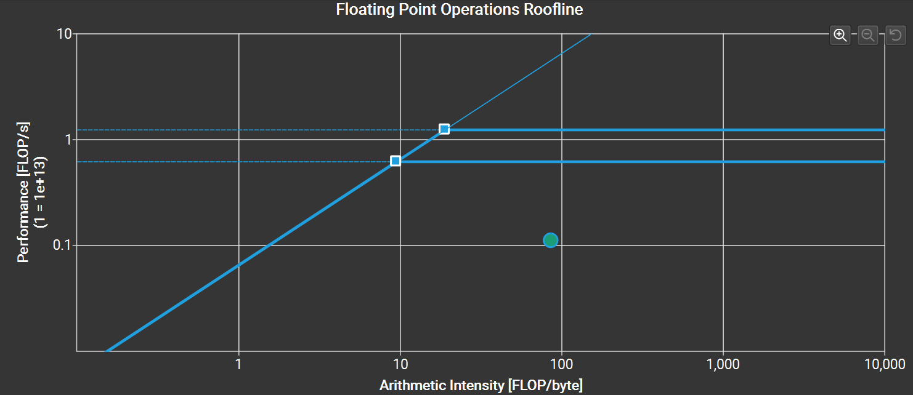
    <figcaption>Baseline roofline analysis</figcaption>   
    
    <figcaption>Separated kernel roofline analysis</figcaption>

    Nsys gives the following profiling data, which is an improvement over the baseline.

    | Name | Time | Total Time | Instances | Average |
    | - | -: | -: | -: | -: |
    | `conv` (Layer 1) | 23.9% | 17.446 ms | 1 | 17.446 ms |
    | `conv` (Layer 2) | 76.1% | 55.522 ms | 1 | 55.522 ms |
    <figcaption>Nsys profiling of the separated kernel</figcaption>

    The kernel is now memory bound, suggesting the optimization greatly reduced the number of instructions and branches executed by allowing for loop unrolling and elimination of indexing calculations, as shown by Nsight.

    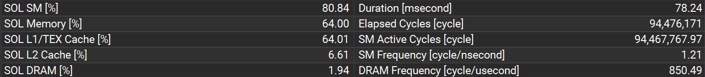
    <figcaption>Baseline kernel statistics</figcaption>   
    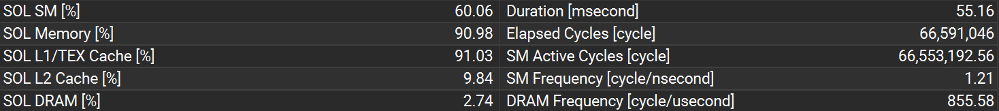
    <figcaption>Separate kernel statistics</figcaption>


5.  No external resources were used to implement this optimization.

6.  The new kernel:
    ```cpp
     template<typename OutputType, typename InputType, typename MaskType>
    __global__ void conv(OutputType output, InputType input, MaskType mask)
    {
        constexpr int gridWidth = CeilDiv(output.sizeX, TILE_SIZE);

        const int b = blockIdx.z;
        const int m = blockIdx.x;
        const int h = (blockIdx.y / gridWidth) * TILE_SIZE + threadIdx.y;
        const int w = (blockIdx.y % gridWidth) * TILE_SIZE + threadIdx.x;

        float accum = 0.0f;
        for (int c = 0; c < mask.sizeZ; c++)
        {
            for (int p = 0; p < mask.sizeY; p++)
            {
                for (int q = 0; q < mask.sizeX; q++)
                {
                    if ((h + p < input.sizeY) && (w + q < input.sizeX))
                    {
                        accum += input(b, c, h + p, w + q) * mask(m, c, p, q);
                    }
                }
            }
        }
        if ((h < output.sizeY) && (w < output.sizeX))
        {
            output(b, m, h, w) = accum;
        }
    }
    ```
    The tensor class with compile-time constant dimensions:
    ```cpp
    template<int SizeW = 0, int SizeZ = 0, int SizeY = 0, int SizeX = 0>
    class Tensor4D
    {
    public:
    	    Tensor4D(float* pDeviceData) :
    		m_pDeviceData(pDeviceData)
    	{
    	}

    	operator ConstTensor4D<SizeW, SizeZ, SizeY, SizeX>()
    	{
    		return ConstTensor4D<SizeW, SizeZ, SizeY, SizeX>(m_pDeviceData);
    	}

    	CUDA_CALLABLE float& operator()(int w, int z, int y, int x)
    	{
    		return m_pDeviceData[sizeZ * sizeY * sizeX * w + sizeY * sizeX * z + sizeX * y + x];
    	}

    	CUDA_CALLABLE const float& operator()(int w, int z, int y, int x) const
    	{
    		return m_pDeviceData[sizeZ * sizeY * sizeX * w + sizeY * sizeX * z + sizeX * y + x];
    	}

    	CUDA_CALLABLE const float& operator[](int idx) const
    	{
    		return m_pDeviceData[idx];
    	}

    	CUDA_CALLABLE float& operator[](int idx)
    	{
    		return m_pDeviceData[idx];
    	}

    	static constexpr int sizeW = SizeW;
    	static constexpr int sizeZ = SizeZ;
    	static constexpr int sizeY = SizeY;
    	static constexpr int sizeX = SizeX;

    private:
    	float* m_pDeviceData;
    };
    ```
    The template specialization for a variable batch size:
    ```cpp
    template<int SizeZ, int SizeY, int SizeX>
    class Tensor4D<0, SizeZ, SizeY, SizeX>
    {
    public:
    	Tensor4D(int sizeW, float* pDeviceData) :
    		sizeW(sizeW), m_pDeviceData(pDeviceData)
    	{
    	}

    	operator ConstTensor4D<0, SizeZ, SizeY, SizeX>()
    	{
    		return ConstTensor4D<0, SizeZ, SizeY, SizeX>(sizeW, m_pDeviceData);
    	}

    	CUDA_CALLABLE float& operator()(int w, int z, int y, int x)
    	{
    		return m_pDeviceData[sizeZ * sizeY * sizeX * w + sizeY * sizeX * z + sizeX * y + x];
    	}

    	CUDA_CALLABLE const float& operator()(int w, int z, int y, int x) const
    	{
    		return m_pDeviceData[sizeZ * sizeY * sizeX * w + sizeY * sizeX * z + sizeX * y + x];
    	}

    	CUDA_CALLABLE const float& operator[](int idx) const
    	{
    		return m_pDeviceData[idx];
    	}

    	CUDA_CALLABLE float& operator[](int idx)
    	{
    		return m_pDeviceData[idx];
    	}

    	int sizeW;
    	static constexpr int sizeZ = SizeZ;
    	static constexpr int sizeY = SizeY;
    	static constexpr int sizeX = SizeX;

    private:
    	float* m_pDeviceData;
    };
    ```

## Optimization 2: Shared memory matrix multiplication and input matrix unrolling

1.  I implemented this optimization because it is a gateway to many of the other choices on this list and is the basic idea behind many high-performance convolution kernels in GPU libraries like Nvidia's cuDNN.

2.  The optimization works by replicating input elements to form a Toeplitz matrix which implements the convolution operation.
    Because matrix multiplication is very efficient on GPUs due to its regular memory access pattern and high potential for reusing operands, the cost of expanding the input tensor into the matrix and therefore increasing the memory requirement by approximately K &times; K may be worth it.
    In this basic form, the unrolled input matrix is created in global memory.
    Because the matrix is too large to unroll fully with a batch size of 10000, we split it up into batches of at most 5000.
    The filer bank matrix does not need to be unrolled, because it already has size M &times; C K K.

    I do not expect this optimization to improve the performance, because it incurs a large overhead by increasing the amount of global memory traffic in order to create and use the unrolled matrix.
    The cost of creating the temporary allocation with `cudaMalloc` is also expected to be large.
    Moreover, the parallelism is somewhat reduced because the input is too large to fully unroll.
    So, this optimization is likely to slow down the convolution layer.
    
    It does not synergize specifically with the previous optimization, however the kernels do make use of compile-time indexing calculations and the compiler should be able to unroll loops as a result.

3.  | Batch size | Op time 1 | Op time 2 | Sum of op times | Execution time | Accuracy |
    | - | -: | -: | -: | -: | -: |
    | 100 | 9.15358 ms | 6.55818 ms | 15.71176 ms | 0 m 1.213 s | 0.86 |
    | 1000 | 16.4163 ms | 11.5452 ms | 27.9615 ms | 0 m 9.720 s | 0.886 |
    | 10000 | 94.78 ms | 62.2869 ms | 157.0669 ms | 1 m 34.956 s | 0.8714 |
    <figcaption>Unroll kernel performance</figcaption>

4.  Clearly this optimization did not improve performance, which is shown by the following Nsys results.

    | Name | Time | Total Time | Instances | Average |
    | - | -: | -: | -: | -: |
    | `unroll` (Layer 1) | 28.6% | 40.131 ms | 2 | 20.065 ms |
    | `gemm` (Layer 1) | 31.4% | 44.045 ms | 2 | 22.022 ms |
    | `unroll` (Layer 2) | 19.5% | 27.288 ms | 2 | 13.644 ms |
    | `gemm` (Layer 2) | 20.5% | 28.824 ms | 2 | 14.412 ms |
    <figcaption>Nsys profiling of the unroll kernel</figcaption>

    Nsys also shows an extra 3.912 ms and 2.870 ms required to create the temporary allocation for the unrolled input matrix with `cudaMalloc` for the first and second layers respectively.
    The overhead of allocating memory and running the unroll kernel is simply too large, even though the GEMM is relatively fast, at least for the second layer.
    The first layer uses a more irregular matrix shape since there are only 4 output feature maps, which degrades performance by launching inactive threads at tile edges.
    A detailed analysis of the kernel shows the unrolling step performs very little computation and is memory bound.

    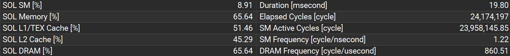
    <figcaption>Unroll kernel statistics</figcaption>

    The tiled GEMM is still memory bound, although not as much as the unrolling step:

    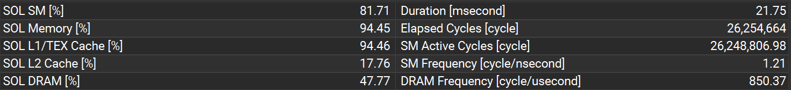
    <figcaption>Tiled GEMM kernel statistics</figcaption>

    
    <figcaption>Tiled GEMM kernel roofline analysis</figcaption>

    These results suggest more reuse of matrix elements or better memory access patterns are required for an optimal GEMM implementation.


5.  To implement this optimization I referenced chapter 16 of the course textbook, the lecture 12 notes and the MP3 code for shared memory tiled matrix multiplication.

6.  The unrolling kernel:
    ```cpp
    template<int K, typename UnrolledType, typename InputType>
    __global__ void unroll(UnrolledType unrolled, InputType input)
    {
        __shared__ float sharedInput[INPUT_TILE_SIZE][INPUT_TILE_SIZE];

        constexpr int widthOut = input.sizeX - K + 1;
        constexpr int heightOut = input.sizeY - K + 1;

        const int tx = threadIdx.x;
        const int ty = threadIdx.y;

        const int w = blockIdx.x * OUTPUT_TILE_SIZE + tx;
        const int h = blockIdx.y * OUTPUT_TILE_SIZE + ty;

        const int b = blockIdx.z / input.sizeZ;
        const int c = blockIdx.z % input.sizeZ;

        if ((h < input.sizeY) && (w < input.sizeX))
        {
            sharedInput[ty][tx] = input(b, c, h, w);
        }
        else
        {
            sharedInput[ty][tx] = 0.0f;
        }
        __syncthreads();

        if ((tx < OUTPUT_TILE_SIZE) && (ty < OUTPUT_TILE_SIZE) && (h < heightOut) && (w < widthOut))
        {
            const int row = c * K * K;
            const int col = h * widthOut + w;
            for (int p = 0; p < K; p++)
            {
                for (int q = 0; q < K; q++)
                {
                    unrolled(0, b, row + p * K + q, col) = sharedInput[ty + p][tx + q];
                }
            }
        }
    }
    ```
    The matrix multiplication kernel:
    ```cpp
    template<typename MaskType, typename InputType, typename OutputType>
    __global__ void gemm(MaskType mask, InputType input, OutputType output)
    {
        __shared__ float sharedA[TILE_SIZE][TILE_SIZE];
        __shared__ float sharedB[TILE_SIZE][TILE_SIZE];

        constexpr int M = mask.sizeY;
        constexpr int N = input.sizeX;
        constexpr int K = mask.sizeX;

        const int row = blockIdx.y * blockDim.y + threadIdx.y;
        const int col = blockIdx.x * blockDim.x + threadIdx.x;
        const int b = blockIdx.z;

        float value = 0.0f;
        for (int start_k = 0; start_k < K; start_k += TILE_SIZE)
        {
            // Load elements into shared memory
            const bool inBoundsA = (row < M) && (start_k + threadIdx.x < K);
            sharedA[threadIdx.y][threadIdx.x] = inBoundsA ? mask[row * K + start_k + threadIdx.x] : 0.0f;

            const bool inBoundsB = (start_k + threadIdx.y < K) && (col < N);
            sharedB[threadIdx.y][threadIdx.x] = inBoundsB ? input(0, b, start_k + threadIdx.y, col) : 0.0f;
            __syncthreads();

            for (int k = 0; k < TILE_SIZE; k++)
            {
                value += sharedA[threadIdx.y][k] * sharedB[k][threadIdx.x];
            }
            __syncthreads();
        }

        if ((row < M) && (col < N))
        {
            output(0, b, row, col) = value;
        }
    }
    ```

## Optimization 3: Kernel fusion for unrolling and matrix multiplication

1.  I chose this optimization because it could help improve the previous technique's disappointing results by avoiding memory transfer overhead, keeping all computations in one kernel.

2.  The fused kernel is conceptually similar to shared memory matrix multiplication, except the unrolled matrix is never created explicitly.
    It is instead created on the fly as tiles are loaded into shared memory.
    This optimization should improve performance since it avoids the costly temporary allocation and decreases the number of global memory accesses.
    It is a direct improvement of the previous code and also builds on the GEMM algorithm developed there.

3.  | Batch size | Op time 1 | Op time 2 | Sum of op times | Execution time | Accuracy |
    | - | -: | -: | -: | -: | -: |
    | 100 | 0.444332 ms | 0.296543 ms | 0.740875 ms | 0 m 3.407 s | 0.86 |
    | 1000 | 4.31344 ms | 2.54895 ms | 6.86239 ms | 0 m 12.714 s | 0.886 |
    | 10000 | 42.62 ms | 25.3123 ms | 67.9323 ms | 1 m 41.829 s | 0.8714 |
    <figcaption>Implicit GEMM kernel performance</figcaption>

4.  Compared to the previous kernel, the performance improved dramatically.
    However, the first layer is still slower than the baseline while a good speedup was achieved for the second layer as seen in Nsys.

    | Name | Time | Total Time | Instances | Average |
    | - | -: | -: | -: | -: |
    | `conv` (Layer 1) | 63.0% | 43.180 ms | 1 | 43.180 ms |
    | `conv` (Layer 2) | 37.0% | 25.394 ms | 1 | 25.394 ms |
    <figcaption>Nsys profiling of the implicit GEMM kernel</figcaption>

    GPU usage statistics from Nsight are shown below for Layer 2.
    Layer 1 has very similar results and both are memory bound, with the shared memory bandwidth nearly saturated.
    This results in many stalls due to Stall MIO Throttle, which is related to shared memory accesses.

    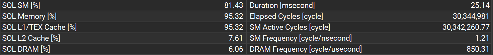
    <figcaption>Implict GEMM kernel statistics</figcaption>

    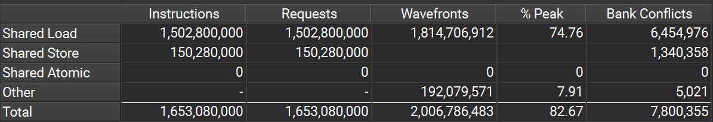
    <figcaption>Implict GEMM kernel shared memory workload</figcaption>

    From roofline analysis, the arithmetic intensity in FLOPs / byte is suitably high, although we do not achieve anywhere near the maximum FP32 performance.

    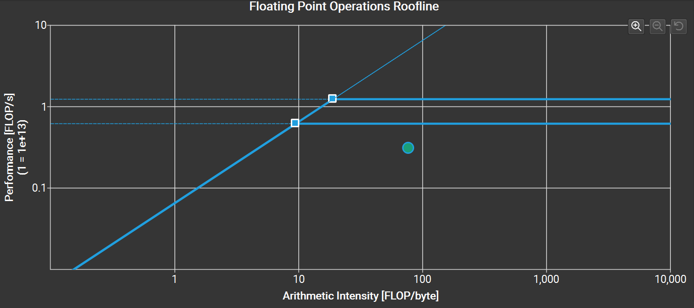
    <figcaption>Implict GEMM kernel roofline analysis</figcaption>

    If both layers have near identical Nsight profiling results, what causes the performance degradation of Layer 1?
    The reason is tile quantization.
    Since the GEMM tile size is 16 &times; 16, with M = 4 three-quarters of the threads are essentially doing nothing.
    Yet, Layer 1 has a larger output filter map size so it launches with many more blocks &mdash; 4000000 vs. 722500 according to Nsys &mdash; and therefore takes longer to execute in total.
    Adjusting the tile size individually for each layer should give an improvement, however we will deal with this differently by changing the algorithm completely in the next optimization.

5.  To implement this optimization I referred to the MP3 code for shared memory matrix multiplication and the NVIDIA CUTLASS library documentation for implicit GEMM convolution at https://github.com/NVIDIA/cutlass/blob/main/media/docs/implicit_gemm_convolution.md.

6.  The fused unrolling and matrix multiplication kernel:
    ```cpp
    template<typename OutputType, typename InputType, typename MaskType>
    __global__ void conv(OutputType output, InputType input, MaskType mask)
    {
        __shared__ float sharedA[TILE_SIZE][TILE_SIZE];
        __shared__ float sharedB[TILE_SIZE][TILE_SIZE];

        constexpr int gemm_K = mask.sizeZ * mask.sizeY * mask.sizeX;
        constexpr int gemm_M = output.sizeZ;
        const int gemm_N = output.sizeW * output.sizeY * output.sizeX;
        
        const int gridWidth = CeilDiv(output.sizeW * output.sizeY * output.sizeX, TILE_SIZE);
        const int idx = blockIdx.x;
        const int gemm_m = blockDim.y * (idx / gridWidth) + threadIdx.y;
        const int gemm_n = blockDim.x * (idx % gridWidth) + threadIdx.x;

        const int b = gemm_n / (output.sizeY * output.sizeX);
        const int br = gemm_n % (output.sizeY * output.sizeX);

        const int ho = br / output.sizeX;
        const int wo = br % output.sizeX;

        float value = 0.0f;
        for (int i = 0; i < gemm_K; i += TILE_SIZE)
        {
            const int c1 = (i + threadIdx.x) / (mask.sizeX * mask.sizeY);
            const int cr1 = (i + threadIdx.x) % (mask.sizeX * mask.sizeY);
            const int c2 = (i + threadIdx.y) / (mask.sizeX * mask.sizeY);
            const int cr2 = (i + threadIdx.y) % (mask.sizeX * mask.sizeY);
            
            const int r1 = cr1 / mask.sizeX;
            const int s1 = cr1 % mask.sizeX;
            const int r2 = cr2 / mask.sizeX;
            const int s2 = cr2 % mask.sizeX;

            const int hi = ho + r2;
            const int wi = wo + s2;

            // Load elements into shared memory
            const bool inBoundsA = (gemm_m < gemm_M) && (i + threadIdx.x < gemm_K);
            sharedA[threadIdx.y][threadIdx.x] = inBoundsA ? mask(gemm_m, c1, r1, s1) : 0.0f;

            const bool inBoundsB = (i + threadIdx.y < gemm_K) && (gemm_n < gemm_N);
            sharedB[threadIdx.y][threadIdx.x] = inBoundsB ? input(b, c2, hi, wi) : 0.0f;
            __syncthreads();

            for (int j = 0; j < TILE_SIZE; j++)
            {
                value += sharedA[threadIdx.y][j] * sharedB[j][threadIdx.x];
            }
            __syncthreads();
        }

        if ((gemm_m < gemm_M) && (gemm_n < gemm_N))
        {
            output(b, gemm_m, ho, wo) = value;
        }
    }
    ```

## Optimization 4: An advanced matrix multiplication algorithm

1.  I implemented this optimization based on the observation that the matrices used to calculate the convolution are not regular &mdash; the M and K dimensions are both small compared to the N dimension.
    Indeed, the first layer only has M = 4 while the second layer has M = 16.
    A more suitable matrix multiplication kernel should take advantage of this by using an algorithm designed with these points in mind.

2.  The new matrix multiplication algorithm loads the mask matrix into shared memory but keeps the input elements in registers.
    Each thread is responsible for computing a whole column of the output, so there is no need or possibility for inter-thread input element reuse.
    We also use a larger tile size when loading the filter bank.
    This optimization should improve performance because accessing elements from registers has an even higher bandwidth than shared memory.
    Also, reuse of mask elements is increased with a bigger tile size.
    
    The code changes synergize with the previous matrix multiplication implementations by boosting their efficiency while retaining the same overall approach.

3.  | Batch size | Op time 1 | Op time 2 | Sum of op times | Execution time | Accuracy |
    | - | -: | -: | -: | -: | -: |
    | 100 | 0.063453 ms | 0.16115 ms | 0.224603 ms | 0 m 1.210 s | 0.86 |
    | 1000 | 0.476174 ms | 1.22869 ms | 1.704864 ms | 0 m 9.707 s | 0.886 |
    | 10000 | 4.63688 ms | 11.9346 ms | 16.57148 ms | 1 m 39.380 s | 0.8714 |
    <figcaption>Register tiled kernel performance</figcaption>

4.  The register tiled matrix multiplication improves the op times significantly, especially for the first layer because it no longer suffers from the tile quantization issue.
    Nsys kernel results are given below.

    | Name | Time | Total Time | Instances | Average |
    | - | -: | -: | -: | -: |
    | `conv` (Layer 1) | 28.0% | 4.627 ms | 1 | 4.627 ms |
    | `conv` (Layer 2) | 72.0% | 11.915 ms | 1 | 11.915 ms |
    <figcaption>Nsys profiling of the register tiled kernel</figcaption>

    From Nsight we can see that the kernel is still memory bound, which is not surprising given the small M dimension of the mask matrix.
    However, the pressure on shared memory bandwidth is lower compared to the previous optimization.
    Because of this, Stall MIO Throttle is no longer the dominant stall reason. 

    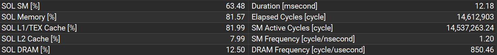
    <figcaption>Register tiled kernel statistics</figcaption>

    
    <figcaption>Register tiled shared memory workload</figcaption>
    
    This kernel achieves results much closer to the FP32 roofline compared to the simple tiled implementation.

    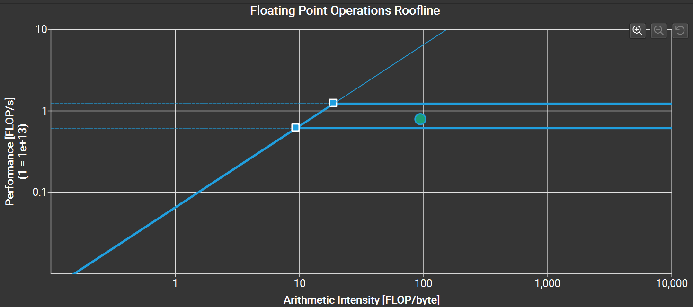
    <figcaption>Register tiled kernel roofline analysis</figcaption>

    The occupancy is unfortunately low because the kernel uses many registers.
    This could lead to insufficient latency hiding and reduce overall performance.
    Switching to FP16 data types as in the next section may help alleviate this problem, because they consume less register space.

    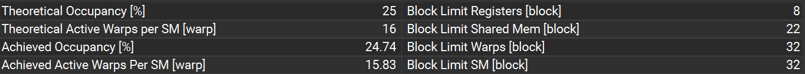
    <figcaption>Register tiled kernel occupancy</figcaption>

5.  To write a register-tiled matrix multiplication kernel I referenced:
    -   V. Volkov and J. W. Demmel, "Benchmarking GPUs to tune dense linear algebra," SC '08: Proceedings of the 2008 ACM/IEEE Conference on Supercomputing, Austin, TX, USA, 2008, pp. 1-11, https://doi.org/10.1109/SC.2008.5214359.
    -   C. Rivera, J. Chen, N. Xiong, J. Zhang, S. L. Song and D. Tao, "TSM2X: High-performance tall-and-skinny matrix–matrix multiplication on GPUs," Journal of Parallel and Distributed Computing, Volume 151, 2021, pp. 70-85, https://doi.org/10.1016/j.jpdc.2021.02.013.

6.  The fused matrix multiplication kernel with register tiling:
    ```cpp
    template<typename OutputType, typename InputType, typename MaskType>
    __global__ void conv(OutputType output, InputType input, MaskType mask)
    {
        constexpr int gemm_M = output.sizeZ;
        constexpr int gemm_K = input.sizeZ * mask.sizeX * mask.sizeY;
        const int gemm_N = output.sizeW * output.sizeY * output.sizeX;

        // Pad the shared memory to help avoid any bank conflict
        __shared__ float sharedA[gemm_M][BK + 1];
        float regB[TK];

        const int gemm_n = blockIdx.x * blockDim.x + threadIdx.x;
        if (gemm_n >= gemm_N)
        {
            return;
        }

        const int b = gemm_n / (output.sizeY * output.sizeX);
        const int br = gemm_n % (output.sizeY * output.sizeX);

        float result[gemm_M] = { 0.0f };
        #pragma unroll
        for (int blockStart_k = 0; blockStart_k < gemm_K; blockStart_k += BK)
        {
            // Load a tile from mask into shared memory
            for (int m = 0; m < gemm_M; m++)
            {
                sharedA[m][threadIdx.x] = mask[m * gemm_K + blockStart_k + threadIdx.x];
                if (blockStart_k + threadIdx.x < gemm_K)
                {
                    sharedA[m][threadIdx.x] = mask[m * gemm_K + blockStart_k + threadIdx.x];
                }
                else
                {
                    sharedA[m][threadIdx.x] = 0.0f;
                }
            }
            __syncthreads();

            #pragma unroll
            for (int threadStart_k = 0; threadStart_k < BK; threadStart_k += TK)
            {
                // Load a tile from input into the registers
                for (int k = 0; k < TK; k++)
                {
                    const int gemm_k = blockStart_k + threadStart_k + k;

                    if (gemm_k < gemm_K)
                    {
                        const int c = gemm_k / (mask.sizeY * mask.sizeX);
                        const int cr = gemm_k % (mask.sizeY * mask.sizeX);

                        const int hi = (br / output.sizeX) + (cr / mask.sizeX);
                        const int wi = (br % output.sizeX) + (cr % mask.sizeX);

                        regB[k] = input(b, c, hi, wi);
                    }
                    else
                    {
                        regB[k] = 0.0f;
                    }
                }

                // Perform the inner product computation
                #pragma unroll
                for (int m = 0; m < gemm_M; m++)
                {
                    #pragma unroll
                    for (int k = 0; k < TK; k++)
                    {
                        result[m] += regB[k] * sharedA[m][threadStart_k + k];
                    }
                }
            }
            __syncthreads();
        }

        // Store results to output
        #pragma unroll
        for (int m = 0; m < gemm_M; m++)
        {
            output(b, m, br / output.sizeX, br % output.sizeX) = result[m];
        }
    }
    ```

## Optimization 5: FP16 arithmetic

1.  The previous optimization has low occupancy because it uses many registers.
    I pursued this optimization since using 16-bit floats should require half as many registers to achieve the same data reuse.
    It also decreases the kernel's shared memory requirements and is a prerequisite to using Tensor Cores.

2.  The optimization works by using the `half2` data type to store 2 16-bit floats in the same amount of space as one 32-bit float.
    To maximize arithmetic throughput it also uses vectorized device math functions like `__hfma2()` which performs 2 FP16 multiply-accumulate operations at once.
    We also take advantage of the lower shared memory footprint of half-precision data to load the entire mask matrix at once for each tile.
    These changes should improve performance by increasing the reuse of filter elements and reducing register pressure.
    Shared memory bandwidth will hopefully increase as well because two operands, packed in a `half2`, are fetched simultaneously.

    FP16 arithmetic synergizes with the previous optimization by decreasing the register and shared memory requirements of the register-tiled implicit GEMM kernel, but the algorithm is not fundamentally different.

3.  | Batch size | Op time 1 | Op time 2 | Sum of op times | Execution time | Accuracy |
    | - | -: | -: | -: | -: | -: |
    | 100 | 0.051446 ms | 0.126419 ms | 0.177865 ms | 0 m 1.192 s | 0.85 |
    | 1000 | 0.369476 ms | 0.937572 ms | 1.307048 ms | 0 m 10.263 s | 0.888 |
    | 10000 | 3.54865 ms | 9.1142 ms | 12.66285 ms | 1 m 40.727 s | 0.8716 |
    <figcaption>FP16 kernel performance</figcaption>

4.  The Nsys profiling shows a modest improvement with respect to the previous kernel.

    | Name | Time | Total Time | Instances | Average |
    | - | -: | -: | -: | -: |
    | `conv` (Layer 1) | 27.9% | 3.527 ms | 1 | 3.527 ms |
    | `conv` (Layer 2) | 72.1% | 9.113 ms | 1 | 9.113 ms |
    <figcaption>Nsys profiling of the FP16 kernel</figcaption>

    The kernel is now compute bound, which indicates that memory access cannot be optimized much further.

    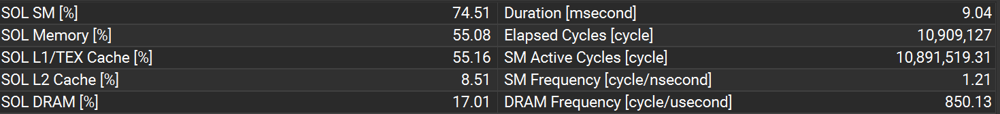
    <figcaption>FP16 kernel statistics</figcaption>
    
    While the occupancy is still not high, using FP16 operands significantly increased it.
    The reduced register and shared memory footprint of half precision data also admitted an increase in tile size, which helped move the bottleneck from memory to compute as mentioned above by enabling greater input element reuse.

    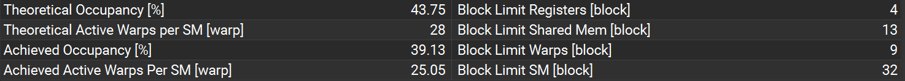
    <figcaption>FP16 kernel statistics</figcaption>

5.  For information on FP16 functions I referenced the CUDA documentation at https://docs.nvidia.com/cuda/cuda-math-api/group__CUDA__MATH__INTRINSIC__HALF.html.

6.  The new kernel using FP16 arithmetic:
    ```cpp
    template<typename OutputType, typename InputType, typename MaskType>
    __global__ void conv(OutputType output, InputType input, MaskType mask)
    {
        const int gemm_N = output.sizeW * output.sizeY * output.sizeX;
        constexpr int gemm_K = input.sizeZ * mask.sizeX * mask.sizeY;
        constexpr int gemm_M = output.sizeZ;
        static_assert(gemm_M % 2 == 0, "M dimension should be a multiple of 2 for half2 packing");

        const int gemm_n = blockIdx.x * blockDim.x + threadIdx.x;
        const int b = gemm_n / (output.sizeY * output.sizeX);
        const int br = gemm_n % (output.sizeY * output.sizeX);

        // Load the entire mask into shared memory
        constexpr int sharedSize_K = NearestMul(gemm_K, TK);
        __shared__ half2 sharedA[gemm_M / 2][sharedSize_K + 1];
        for (int m = 0; m < gemm_M / 2; m++)
        {
            if (threadIdx.x < gemm_K)
            {
                float load1 = mask[(2 * m + 0) * gemm_K + threadIdx.x];
                float load2 = mask[(2 * m + 1) * gemm_K + threadIdx.x];
                sharedA[m][threadIdx.x] = __floats2half2_rn(load1, load2);
            }		
            else
            {
                sharedA[m][threadIdx.x] = __floats2half2_rn(0.0f, 0.0f);
            }
        }
        __syncthreads();

        // Now that the mask has been cooperatively loaded, we can exit if the thread would write
        // out of bounds, since each thread is responsible for a single column of the output matrix,
        // i.e. there is no more cooperation between threads after this point.
        if (gemm_n >= gemm_N)
        {
            return;
        }

        half2 regB[TK / 2];
        half2 result[gemm_M / 2] = { __floats2half2_rn(0.0f, 0.0f) };
        #pragma unroll
        for (int start_k = 0; start_k < gemm_K; start_k += TK)
        {
            // Load a tile from input into the registers
            #pragma unroll
            for (int k = 0; k < TK / 2; k++)
            {
                int gemm_k = start_k + 2 * k;
                float load1;
                if (gemm_k < gemm_K)
                {
                    const int c = gemm_k / (mask.sizeY * mask.sizeX);
                    const int cr = gemm_k % (mask.sizeY * mask.sizeX);

                    const int hi = (br / output.sizeX) + (cr / mask.sizeX);
                    const int wi = (br % output.sizeX) + (cr % mask.sizeX);

                    load1 = input(b, c, hi, wi);
                }
                else
                {
                    load1 = 0.0f;
                }
                gemm_k++;
                float load2;
                if (gemm_k < gemm_K)
                {
                    const int c = gemm_k / (mask.sizeY * mask.sizeX);
                    const int cr = gemm_k % (mask.sizeY * mask.sizeX);

                    const int hi = (br / output.sizeX) + (cr / mask.sizeX);
                    const int wi = (br % output.sizeX) + (cr % mask.sizeX);

                    load2 = input(b, c, hi, wi);
                }
                else
                {
                    load2 = 0.0f;
                }
                regB[k] = __floats2half2_rn(load1, load2);
            }

            // Do the inner product computation
            #pragma unroll
            for (int m = 0; m < gemm_M / 2; m++)
            {
                #pragma unroll
                for (int k = 0; k < TK / 2; k++)
                {
                    half2 lo = __low2half2(regB[k]);
                    half2 hi = __high2half2(regB[k]);
                    result[m] = __hfma2(sharedA[m][start_k + 2 * k + 0], lo, result[m]);
                    result[m] = __hfma2(sharedA[m][start_k + 2 * k + 1], hi, result[m]);
                    result[m] = __hfma2(sharedA[m][start_k + 2 * k + 0], lo, result[m]);
                    result[m] = __hfma2(sharedA[m][start_k + 2 * k + 1], hi, result[m]);
                }
            }
        }

        // Write to output
        #pragma unroll
        for (int m = 0; m < gemm_M / 2; m++)
        {
            float2 out = __half22float2(result[m]);
            output(b, 2 * m + 0, br / output.sizeX, br % output.sizeX) = out.x;
            output(b, 2 * m + 1, br / output.sizeX, br % output.sizeX) = out.y;
        }
    }
    ```

## Optimization 6: Tensor Cores for matrix multiplication

1.  I decided to implement this optimization because Tensor Cores potentially offer a large speedup over traditional CUDA cores for matrix multiplication.

2.  The new kernel loads mask and input matrix elements into shared memory.
    Instead of splitting up the inner product computation among individual threads, each warp cooperatively performs a 16 &times; 16 matrix multiplication using CUDA `wmma` functions.
    Because the minimum number of rows for these functions is 8, the tile quantization overhead proved too high for the first layer where M = 4.
    Therefore, the previous algorithm is still used for this layer.
    Tensor Cores theoretically offer far more compute throughput than CUDA cores, so performance should increase unless the kernel becomes memory-bound.

    Again this optimization builds of previous ones.
    FP16 arithmetic is a prerequisite for using Tensor Cores, as is the reduction of convolution to a matrix multiplication operation.

3.  | Batch size | Op time 1 | Op time 2 | Sum of op times | Execution time | Accuracy |
    | - | -: | -: | -: | -: | -: |
    | 100 | 0.050663 ms | 0.066101 ms | 0.116764 ms | 0 m 1.159 s | 0.85 |
    | 1000 | 0.370451 ms | 0.464547 ms | 0.834998 ms | 0 m 10.243 s | 0.887 |
    | 10000 | 3.53979 ms | 4.29235 ms | 7.83214 ms | 1 m 40.593 s | 0.8713 |

    Interestingly, the accuracy is somewhat different from the basic FP16 implementation even though the same precision is used.
    This is explained in (4), where the authors note that Tensor Cores use a different rounding model than normal CUDA cores for FP16 arithmetic.
    The CUDA cores, as used in the previous kernel, employ round-to-nearest for all FP16 operations while the Tensor Cores use round-to-zero.
    This behavior is unfortunately not documented by Nvidia.

4.  As mentioned previously, Tensor Cores were not used for the first layer because it would be too inefficient due to the lower limit on the matrix M dimension.
    However, there was a large speedup for the second layer as shown in the Nsys results below.

    | Name | Time | Total Time | Instances | Average |
    | - | -: | -: | -: | -: |
    | `conv1` (Layer 1) | 45.2% | 3.524 ms | 1 | 3.524 ms |
    | `conv2` (Layer 2) | 54.7% | 4.267 ms | 1 | 4.267 ms |

    Because the compute bandwidth of Tensor Cores is so high, the kernel is again memory bound.
    However, given the small matrix size of 16 in the M dimension, it is difficult if not impossible to further improve global memory reuse.
    It has been shown in (3) that at least 256 &times; 256 tiling is required to fully saturate the Tensor Core compute capacity, which is not possible for the given problem size.
    One potential improvement would be to take advantage of vectorized loads and stores, although this is only possible for the filter bank matrix due to memory layout requirements and therefore is unlikely to make much of a difference.

    Also, because Volta is the first GPU generation to include Tensor Cores, the available programming interface is not very flexible.
    Recent architectures have introduced new instructions, matrix sizes and data types which may allow for more efficient data transfer directly into registers.
    Greater flexibility regarding matrix dimensions could also enable effective use of Tensor Cores for the first layer.
    These new features have also been explored in (4), although they are only available via inline PTX assembly code.

    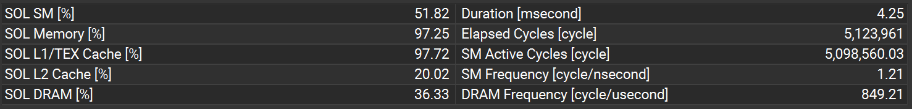
    <figcaption>Tensor Core kernel statistics</figcaption>

    Nsight also shows a low utilization of the Tensor Core units, suggesting that better memory access tuning is required to use their full potential.

    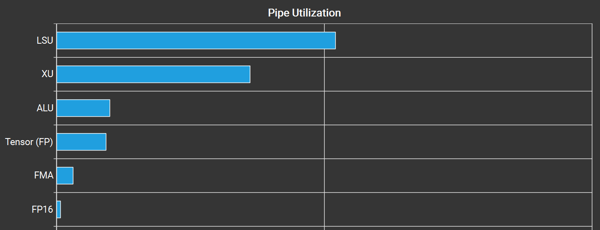
    <figcaption>Tensor Core utilization</figcaption>

    Because the `wmma` functions involve loads and stores from shared memory, there are large demands on the shared memory bandwidth which limit the kernel's throughput.

    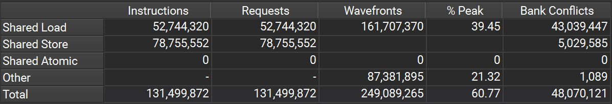
    <figcaption>Tensor Core shared memory statistics</figcaption>

5.  For information on using Tensor Cores I used the relevant section of the CUDA C++ Programming Guide at https://docs.nvidia.com/cuda/cuda-c-programming-guide/#warp-matrix-functions and the PTX ISA at https://docs.nvidia.com/cuda/parallel-thread-execution/#ptx-isa-version-8-1 to determine which matrix operations and sizes are natively supported by Volta hardware.
To investigate the performance characteristics of Tensor Cores I also used the following papers.

    -   (3) M. Fasi, N.J. Higham, M. Mikaitis and S. Pranesh, "Numerical behavior of NVIDIA tensor cores," PeerJ Comp. Sci, 2021, https://doi.org/10.7717/peerj-cs.330.
    -   (4) D. Yan, W. Wang and X. Chu, "Demystifying Tensor Cores to Optimize Half-Precision Matrix Multiply," 2020 IEEE International Parallel and Distributed Processing Symposium (IPDPS), New Orleans, LA, USA, 2020, pp. 634-643, https://doi.org/10.1109/IPDPS47924.2020.00071.

6.  The kernel using tensor cores &mdash; note it is only used for the second convolution layer:
    ```cpp
    template<typename OutputType, typename InputType, typename MaskType>
    __global__ void conv2(OutputType output, InputType input, MaskType mask)
    {
        using namespace nvcuda::wmma;

        // Note we pad the shared memory to reduce bank conflicts
        __shared__ half sharedA[THREAD_BLOCK_Y][THREAD_BLOCK_AX + 16];
        __shared__ half sharedB[THREAD_BLOCK_Y][THREAD_BLOCK_BX + 16];

        constexpr int gemm_M = output.sizeZ;
        constexpr int gemm_K = input.sizeZ * mask.sizeX * mask.sizeY;
        const int gemm_N = output.sizeW * output.sizeY * output.sizeX;

        // Load the tile of mask (A) into shared memory
        constexpr int loadStride = BLOCK_SIZE / THREAD_BLOCK_AX;
        const int load_y = threadIdx.x / THREAD_BLOCK_AX;
        const int load_x = threadIdx.x % THREAD_BLOCK_AX;
        #pragma unroll
        for (int m = 0; m < THREAD_BLOCK_Y; m += loadStride)
        {
            if (load_x < gemm_K)
            {
                sharedA[load_y + m][load_x] = __float2half(mask[(load_y + m) * gemm_K + load_x]);
            }
            else
            {
                sharedA[load_y + m][load_x] = 0.0f;
            }
        }
        __syncthreads();

        // Compute warp index
        const int wx = threadIdx.x / WARP_SIZE;

        // Calculate indices into input and output tensors
        const int gemm_n = blockIdx.x * THREAD_BLOCK_BX + threadIdx.x;
        const int b = gemm_n / (output.sizeY * output.sizeX);
        const int br = gemm_n % (output.sizeY * output.sizeX);
        const int ho = br / output.sizeX;
        const int wo = br % output.sizeX;

        fragment<matrix_a, WMMA_SIZE, WMMA_SIZE, WMMA_SIZE, half, row_major> aFragment;
        fragment<matrix_b, WMMA_SIZE, WMMA_SIZE, WMMA_SIZE, half, row_major> bFragment;

        fragment<accumulator, WMMA_SIZE, WMMA_SIZE, WMMA_SIZE, half> cFragment1;
        fragment<accumulator, WMMA_SIZE, WMMA_SIZE, WMMA_SIZE, half> cFragment2;

        fill_fragment(cFragment1, 0.0f);
        fill_fragment(cFragment2, 0.0f);
        #pragma unroll
        for (int start_k = 0; start_k < gemm_K; start_k += THREAD_BLOCK_Y)
        {
            // Load the mask warp tile from shared memory
            load_matrix_sync(aFragment, &sharedA[0][start_k], THREAD_BLOCK_AX + 16);

            // Load the tile of B into shared memory. Because each part of the tile is loaded and then used
            // by the same warp, block-level synchronization is not needed. 
            // wmma::load_matrix_sync will do warp-level synchronization.
            #pragma unroll
            for (int k = 0; k < THREAD_BLOCK_Y; k++)
            {
                const int gemm_k = start_k + k;
                if ((gemm_k < gemm_K) && (gemm_n < gemm_N))
                {
                    const int c = gemm_k / (mask.sizeY * mask.sizeX);
                    const int cr = gemm_k % (mask.sizeY * mask.sizeX);

                    const int hi = ho + (cr / mask.sizeX);
                    const int wi = wo + (cr % mask.sizeX);

                    sharedB[k][threadIdx.x] = __float2half(input(b, c, hi, wi));
                }
                else
                {
                    sharedB[k][threadIdx.x] = 0.0f;
                }
            }

            // Accumulate matrix products
            load_matrix_sync(bFragment, &sharedB[0][wx * WARP_BLOCK_X], THREAD_BLOCK_BX + 16);
            mma_sync(cFragment1, aFragment, bFragment, cFragment1);

            load_matrix_sync(bFragment, &sharedB[0][wx * WARP_BLOCK_X + WMMA_SIZE], THREAD_BLOCK_BX + 16);
            mma_sync(cFragment2, aFragment, bFragment, cFragment2);
        }

        // Store the output
        store_matrix_sync(&sharedB[0][wx * WARP_BLOCK_X], cFragment1, THREAD_BLOCK_BX + 16, mem_row_major);
        store_matrix_sync(&sharedB[0][wx * WARP_BLOCK_X + WMMA_SIZE], cFragment2, THREAD_BLOCK_BX + 16, mem_row_major);
        if (gemm_n < gemm_N)
        {
            #pragma unroll
            for (int m = 0; m < gemm_M; m++)
            {
                output(b, m, ho, wo) = __half2float(sharedB[m][threadIdx.x]);
            }
        }
    }
    ```
## Optimization 7: Streams for overlapping computation and data transfer

1.  I implemented this optimization because we learnt in lecture that data transfer can be a significant factor in the runtime of CUDA programs, and that this can be ameliorated somewhat by taking advantage of the overlapping compute and transfer queues.

2.  All the changes occur in the host code.
    I decided to split the batches into segments of 1000 and use 3 streams so data transfer can be overlapped in both directions.
    The current stream is selected in based on a loop counter and tasks are dispatched breadth-first to avoid introducing unnecessary dependencies in the device engine queues.
    To transfer the correct data, pointers are updated each loop iteration.

    The kernels are the same as in Optimization 6, since these were the fastest so far.
    Streaming is largely orthogonal to other optimizations, since the data transfer cost is a common factor among all of them.
    Therefore, it should synergize with any convolution approach.
    Performance will certainly increase if GPU operations can be overlapped, however the speedup will depend strongly on the operations' relative durations.

3.  | Batch size | Op time 1 | Op time 2 | Sum of op times | Execution time | Accuracy |
    | - | -: | -: | -: | -: | -: |
    | 100 | 0.003208 ms | 0.001674 ms | 0.004882 ms | 0 m 1.647 s | 0.85 |
    | 1000 | 0.002025 ms | 0.002486 ms | 0.004511 ms | 0 m 9.888 s | 0.887 |
    | 10000 | 0.003351 ms | 0.002892 ms | 0.006243 ms | 1 m 41.706 s | 0.8713 |

    Note that the op times for this optimization are inaccurate.
    Due to the skeleton code's structure, the kernel launches had to be moved into the `conv_forward_gpu_prolog` function.
    Unfortunately, the provided code does not time this prolog function.
    The `conv_forward_gpu` function is now just a stub, because it is not passed the required pointers to do incremental copies to and from the host.

    However, the total execution times are accurate and kernel timing data is still available from Nsys, which will be shown in the next section.

4.  As expected, the GPU kernels themselves, which are unchanged, have almost the same performance as the previous version when considering the aggregate of the 10 segments.
    There is a very small increase in kernel timings, perhaps due to the overhead of launching the kernel.
    Because the kernels are the same as the previous part, the Nsight profiling results should be identical and are not reproduced here.

    | Name | Time | Total Time | Instances | Average |
    | - | -: | -: | -: | -: |
    | `conv1` (Layer 1) | 45.2% | 3.602 ms | 10 | 360.224 μs |
    | `conv2` (Layer 2) | 55.3% | 4.462 ms | 10 | 446.381 μs |

    We can use Nsys to verify that GPU operations are overlapped.
    Blue regions indicate our kernel, green is host-to-device transfer and purple is device-to-host transfer.
    Clearly, 3-way parallelism has been achieved with compute and both PCIe bus directions.

    
    <figcaption>Overlap of computation and data transfer with streams</figcaption>

    To see the impact of streams more closely, it is useful to examine the layer times.

    | Batch size | Layer time 1, no streams | Layer time 2, no streams | Layer time 1, streams | Layer time 2, streams |
    | - | -: | -: | -: | -: |
    | 100 | 6.72165 ms | 5.04419 ms | 6.09647 ms | 5.12623 ms |
    | 1000 | 61.8766 ms | 45.3119 ms | 43.9214 ms | 33.6077 ms |
    | 10000 | 613.862 ms | 432.214 ms | 387.743 ms | 357.329 ms |

    As expected, we only get a significant speedup for the full batch size of 10000 since the segment size is 1000.
    There is however a small performance increase when the batch size is 1000, likely because the memory is pinned for the data transfers.
    When the full training set is used, there is a very substantial decrease in layer times.
    However, the speedup may be smaller than expected because each device-to-host transfer takes much longer than the host-to-device transfer and kernel computation combined.

5.  To implement streaming I used the lecture 22 notes.

6.  The host code implementing streaming:
    ```cpp
    constexpr int SEG_SIZE = 1000;

    void GPUInterface::conv_forward_gpu_prolog(float* pHostOutput, float* pHostInput,
        float* pHostMask, float** ppDeviceOutput, float** ppDeviceInput, float** ppDeviceMask,
        int batch, int map, int channel, int height, int width, int k)
    {
        const int heightOut = height - k + 1;
        const int widthOut = width - k + 1;

        size_t maskSize = map * channel * k * k * sizeof(float);
        size_t inputSize = batch * channel * height * width * sizeof(float);
        size_t outputSize = batch * map * heightOut * widthOut * sizeof(float);
        size_t inputSegSize = channel * height * width * sizeof(float);
        size_t outputSegSize = map * heightOut * widthOut * sizeof(float);

        // Pin memory on host
        CudaCheck(cudaHostRegister(pHostOutput, outputSize, cudaHostRegisterDefault));
        CudaCheck(cudaHostRegister(pHostInput, inputSize, cudaHostRegisterDefault));
        CudaCheck(cudaHostRegister(pHostMask, maskSize, cudaHostRegisterDefault));

        // Allocate device memory for the mask
        float* deviceMask;
        CudaCheck(cudaMalloc(&deviceMask, maskSize));
        CudaCheck(cudaMemcpy(deviceMask, pHostMask, maskSize, cudaMemcpyHostToDevice));

        cudaStream_t streams[3] = {};
        float* deviceInputPtrs[3] = {};
        float* deviceOutputPtrs[3] = {};
        for (int i = 0; i < 3; i++)
        {
            CudaCheck(cudaStreamCreate(&streams[i]));
            CudaCheck(cudaMalloc(&deviceInputPtrs[i], SEG_SIZE * inputSegSize));
            CudaCheck(cudaMalloc(&deviceOutputPtrs[i], SEG_SIZE * outputSegSize));
        }

        int nSegments = CeilDiv(batch, SEG_SIZE);
        for (int i = 0; i < nSegments; i += 2)
        {
            for (int j = 0; j < 2; j++)
            {
                int idx = (i + j) % 3;
                int remBatches = std::min(SEG_SIZE, batch - (i + j) * SEG_SIZE);
                if (remBatches > 0)
                {
                    CudaCheck(cudaMemcpyAsync(deviceInputPtrs[idx], pHostInput, remBatches * inputSegSize,
                        cudaMemcpyHostToDevice, streams[idx]));
                    pHostInput += remBatches * channel * height * width;
                }
            }
            
            // Invoke kernels
            for (int j = 0; j < 2; j++)
            {
                int idx = (i + j) % 3;
                int remBatches = std::min(SEG_SIZE, batch - (i + j) * SEG_SIZE);
                if (remBatches > 0)
                {
                    if (map == MAP_1)
                    {
                        InvokeLayer1(deviceOutputPtrs[idx], deviceInputPtrs[idx], deviceMask, 
                            remBatches, streams[idx]);
                    }
                    else
                    {
                        InvokeLayer2(deviceOutputPtrs[idx], deviceInputPtrs[idx], deviceMask, 
                            remBatches, streams[idx]);
                    }
                }
            }
            
            for (int j = 0; j < 2; j++)
            {
                int idx = (i + j) % 3;
                int remBatches = std::min(SEG_SIZE, batch - (i + j) * SEG_SIZE);
                if (remBatches > 0)
                {
                    CudaCheck(cudaMemcpyAsync(pHostOutput, deviceOutputPtrs[idx], remBatches * outputSegSize, 
                        cudaMemcpyDeviceToHost, streams[idx]));
                    pHostOutput += remBatches * map * heightOut * widthOut;
                }
            }
        }

        CudaCheck(cudaFree(deviceMask));
        for (int i = 0; i < 3; i++)
        {
            CudaCheck(cudaStreamDestroy(streams[i]));
            CudaCheck(cudaFree(deviceInputPtrs[i]));
            CudaCheck(cudaFree(deviceOutputPtrs[i]));
        }
    }
    ```

    ## Speedup Summary

    The sum of op times and relative speedup with respect to the baseline are shown below for all the kernel optimizations.
    They are numbered as in this report, with zero representing the PM2 baseline.
    The host-side streaming optimization is not included, since its effect cannot be accurately measured using these metrics.

    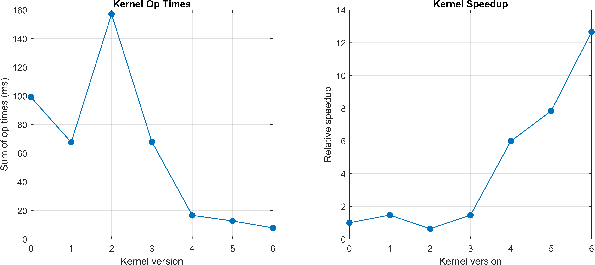
    <figcaption>Performance improvement summary</figcaption>

